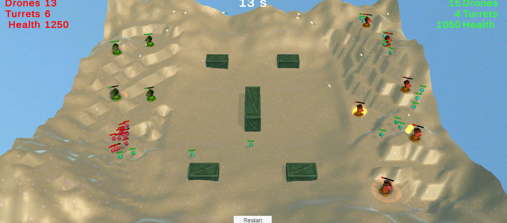
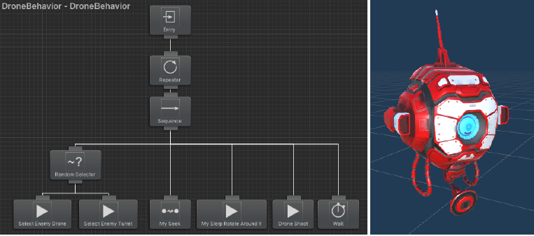

# Red VS Green

# Objectifs

* Découverte de certaines techniques d’IA utilisées dans le jeu vidéo pour la prise de décision des PNJ, en particulier les arbres de comportement (Behavior Trees)
* Elaboration d’arbres de comportement pour des unités combattantes dans un mini-jeu de genre “RTS Wargame”

# Modalités
* Présentation magistrale à base de slides
* Projet TP de développement en groupes de 4 étudiants sous Unity3D/C#

# Pré-requis

Une première expérience de développement sous Unity3D/C# est préconisée pour la réalisation du projet.

# Logiciels à Installer
* Unity3D version LTS 2021.3.30f1 (...ou supérieure). Tous les membres d’une même
équipe devront utiliser la même version
* Un IDE de développement C# compatible avec Unity3D: Visual Studio, Visual Studio
Code, Jetbrains Rider
* Un client Git: SourceTree, GitKraken, GitHub Desktop

# Projet
Deux armées (ROUGE et VERTE) s’affrontent sur un terrain de 60m x 60m constitué d’une plaine, de terrasses surplombantes et d’obstacles divers.
Chaque armée occupe un côté de la map. Deux types d’unités sont proposées:
* des drones mobiles capables de se rapprocher d’une cible, de viser puis tirer des missiles à la trajectoire “rectiligne”
* des tourelles d’artillerie (mortiers) statiques et orientables, capables de viser et de tirer des grenades à la trajectoire parabolique (comportement balistique)

Un missile tiré par un drone n’inflige des dégâts qu’à l’unité adverse
avec laquelle il collisionne.
Une grenade tirée par un mortier, lorsqu’elle retombe sur le sol, inflige des dégâts de zone
aux unités adverses se trouvant dans son rayon d’action.

# Evaluation
L’évaluation porte uniquement sur le projet et prend en compte:
* la réflexion stratégique et tactique
* la complexité des arbres de comportement
* la qualité de développement des scripts C#
* l’efficacité de l’armée. Voir l’Annexe B pour les critères statistiques

# Modalités de livraison

La date limite de livraison est fixée au dimanche 15 octobre 2023 à 23h59.
Vous devez livrer une archive compressée, en me les partageant depuis votre compte Google Drive (ou autre) sur l’adresse dbilemdjian@gmail.com. Par contre, vous décochez « Envoyer une notification » lorsque vous partagez votre fichier, et vous m’envoyez le lien de partage « Link to share » de l’archive (je dis bien l’archive, pas le répertoire) par retour du mail d’envoi ce document.

Votre mail de livraison ne doit donc contenir, au-delà des formules de politesse d’usage, que
le lien Drive pointant vers l’archive.

Description du contenu de l’archive:
* Un fichier ReleaseNotes exposant:
    * les noms des membres de l’équipe
    * votre réflexion stratégique et tactique
    * ce qui a été développé:
        * arbres de comportement
        * scripts C#
    * vos remarques particulières: limitations, bugs
    connus, voies d'amélioration
    * la répartition de la production: qui a fait quoi ?
* Un fichier CSV (utilisez la tabulation “\t” comme séparateur
des données) listant les résultats statistiques, une ligne par
bataille. Un fichier template vous a été fourni. Voir Annexe B.
* une vidéo (HD ou Full HD) compressée d’un combat épique
* le projet Unity3D, dont vous aurez pris soin de retirer le répertoire Library

Le nom de cette archive doit adopter la nomenclature suivante:
**EPF_2023_2024_DecisionAI_UnityProject_<Nom1Nom2Nom3Nom4>.zip**

# See more :
[Release notes](Ressources\ReleaseNotes.md)